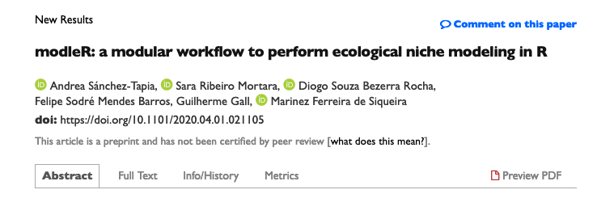
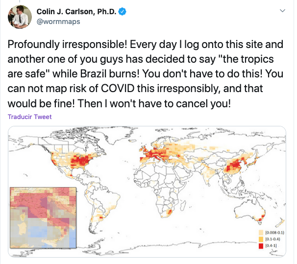
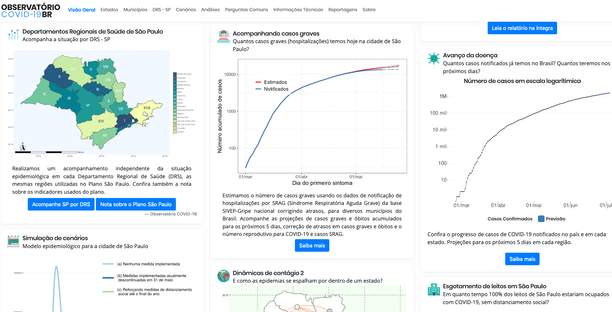
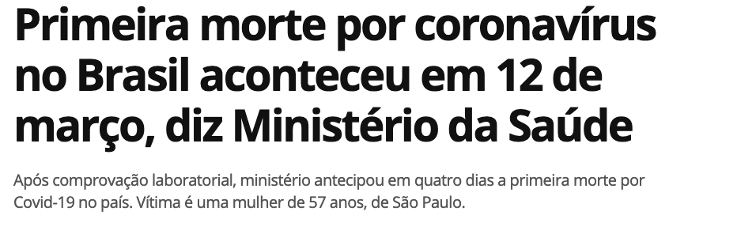
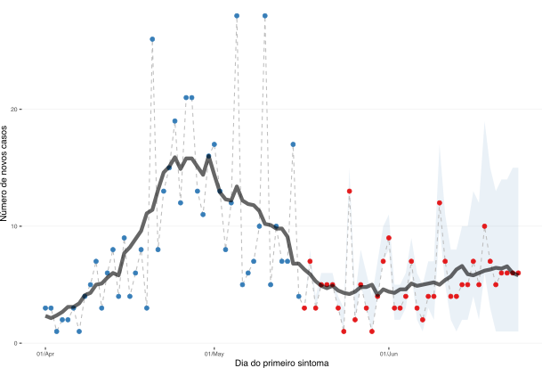
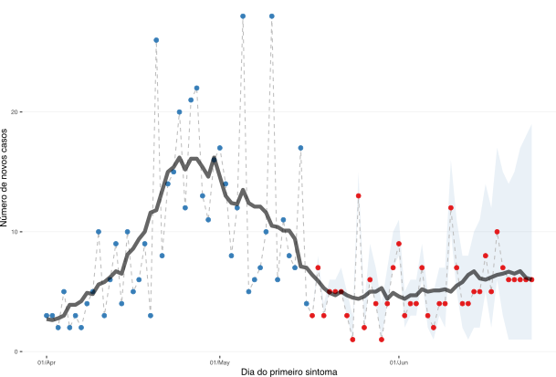
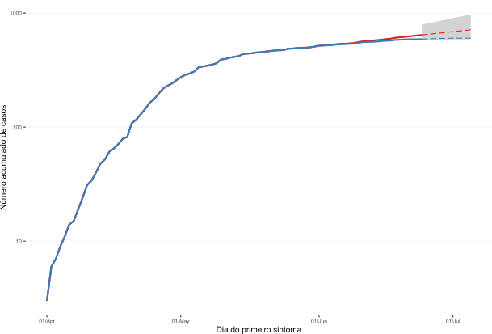
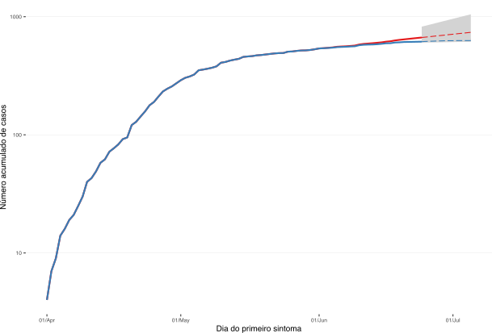

```{r setup, include=FALSE}
options(htmltools.dir.version = FALSE)
```

```{r xaringan-themer, include=FALSE, warning=FALSE}
library(xaringanthemer)
style_duo_accent(
  primary_color = "#562457",
  secondary_color = "#562457",
  colors = c(
    red = "#A70000",
    purple = "#88398a",
    orange = "#ff8811",
    green = "#136f63",
    blue = "#4B4FFF",
    white = "#FFFFFF",
    black = "#181818"
  ),
  text_bold_color = "#181818",
  header_font_google = google_font("Roboto Condensed"),
  text_font_google = google_font("Roboto", "300", "300i"),
  code_font_google = google_font("Fira Mono"), text_font_size = "25px"
)
```

### Apresentação


+ Bióloga - Universidade Nacional da Colômbia  
+ Mestre em Ecologia - UFRJ
+ Doutora em Botânica - JBRJ
+ .purple[Pós-doc - Núcleo de Computação Científica e Geoprocessamento do JBRJ (Marinez Ferreira de Siqueira)]

Ecologia de comunidades vegetais, restauração ecológica, ecologia quantitativa  

__Informática da biodiversidade__, modelagem de nicho ecológico

__Ciência aberta e reprodutível__, ética na ciência de dados, ciência de dados feminista


---
background-image: url("figs/coleguinhes.png")
background-position: 68% 64%
background-size: 600px

## Pacote de R para modelagem de nicho ecológico: .red[modleR]

+ __Unificar__ diferentes partes do processo de MNE
+ Fornecer __metadados__ e __documentar__ decisões de parametrização
+ Se __integrar__ ao resto de ferramentas que existem no ambiente de `R`

<br>
```{r, echo = FALSE, out.width= 150}

```

<small>
Marinez F Siqueira, Sara Mortara, Diogo Rocha, Guilherme Gall, Felipe Sodré
</small>

.pull-left[

`r icon::fa("firefox")` 
<small>
[https://model-r.github.io/modleR/](https://model-r.github.io/modleR/)
</small>
]

.pull-right[
<p style="text-align:center;">

`r icon::fa("youtube")` 

<a href="https://www.youtube.com/watch?v=4Xw33TdIVXA">Aula no curso ENM-2020</a>

</p>

]

---
class: bottom, center
background-image: url("figs/modleR.png")
background-position: 50% 0%
background-size: 800px

```{r, echo = FALSE, out.width= 800}

```

---
#### A MNE não deve ser usada para modelar a distribuição da pandemia .purple[`#spoileralert`]

<center>
```{r, echo = FALSE, out.width = 500}
#knitr::include_graphics("./figs/1climate.png")
#knitr::include_graphics("./figs/3inappropriate.png")
#knitr::include_graphics("./figs/4useful.png")

```
</center>
---
background-image: url("figs/logo_jbrj.png")
background-position: 98% 5%
background-size: 100px

 <!-- + "Curso de `R`" : ensino de ferramentas de computação científica `R` <br> --> 

### Curso sobre ciência aberta e fluxos de trabalho reprodutíveis
#### (Um curso de `R` sqn)

.pull-left[
```{r, echo = FALSE, out.width= 320}
knitr::include_graphics("./figs/turma.JPG")
```
Turma 2020 :) 
]

.pull-right[

__Boas práticas__ em análise de dados

```{r, echo = F, out.width=200}
knitr::include_graphics("./figs/rstudio.jpg")

```

```{r, echo = F, out.width= 80}
knitr::include_graphics("./figs/logo-git.png")
knitr::include_graphics("./figs/GitHub_Logo.png")
knitr::include_graphics("./figs/btibucket.png")
knitr::include_graphics("./figs/gitlab-logo-gray-rgb.png")
```

```{r, echo = F, out.width= 100}
knitr::include_graphics("./figs/latex.jpeg")
knitr::include_graphics("./figs/bibtex.jpeg")

```
```{r, echo = F, out.width= 50}
knitr::include_graphics("./figs/rmarkdown.png")
```
]


 <!-- pensada como seminário
 alunes de várias áreas do conhecimento
 ferramentas que não têm um ensino formal
 de grande utilidade --> 


---
class: center, middle, inverse

# Durante a pandemia

---
background-image: url("figs/coronabr.png")
background-position: 50% 90%
background-size: 700px

## Pacote [.red[coronabr]](https://liibre.github.io/coronabr/index.html)

+ __Disponibilizar__ os dados do Ministério da Saúde, [Brasil I/O](https://brasil.io/dataset/covid19/caso), John Hopkins
+ Sem análises, projeções ou modelos

 <!-- dois colegas de longa data --> 

---
class: middle
background-image: url("figs/obs.png")
background-position: 90% 5%
background-size: 150px

 <!--
+ Criado 14/03/2020 (UNESP, USP, UFABC). 
+ Hoje >40 pesquisadores (modelagem estatística, análises socioeconômicas, epidemiologia, divulgação científica) 
+ Notas técnicas, suporte à tomada de decisão
+ Parcerias locais com Secretarias de Saúde
--> 

```{r, echo = F, out.width= 950}

```


.pull-left[

`r icon::fa("twitter")` .blue[@obscovid19br]
]
.pull-right[
`r icon::fa("firefox")` .blue[covid19br.github.io]
]


---
background-image: url("figs/ridge.png")
background-position: 100% 60%
background-size: 530px

 <!-- + Mais de 40 pesquisadores com diferentes formações e habilidades (epidemologia, modelagem estatística, análises socio-econômica, divulgação científica, criação de conteúdo pedagógico...) --> 
 
####  Grupo de __correção de atrasos__ na notificação por "nowcasting" bayesiano (McGough _et al._ 2020)

 <!-- Data do início dos sintomas  Data da notificação de que o exame deu positivo
Data do óbito  Data da notificação do óbito --> 

.pull-left[

```{r, echo = FALSE, out.width = 300}

```

#### (Notificação: 27/06/2020)

]

.pull-right[

]

---
class: center, middle

#### Tabatinga (AM) 
```{r echo=FALSE, out.width=350}




```


---
class: center, middle

# ¡Gracias!

`r icon::fa("paper-plane", colour = "#562457")` [andreasancheztapia@gmail.com](mailto:andreasancheztapia@gmail.com) 

`r icon::fa("twitter", colour = "#562457")` [@SanchezTapiaA](https://twitter.com/SanchezTapiaA) 

`r icon::fa("github", colour = "#562457")` `r icon::fa("gitlab", colour = "#562457")` `r icon::fa("bitbucket", colour = "#562457")` [andreasancheztapia](http://github.com/andreasancheztapia) 

`r icon::fa("r-project", colour = "#562457")` [R-Ladies+ Rio de Janeiro](https://www.meetup.com/pt-BR/rladies-rio/)

